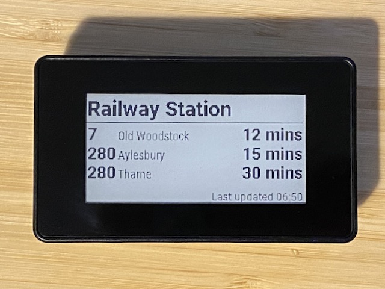

# nimbus

Display bus arrival times on a Raspberry Pi with an e-ink screen.

The display shows up to three upcoming buses for a stop. Touching the display cycles through different stops.



## Hardware
This is inteded for use with:

* A [Raspberry Pi Zero 2 W](https://www.raspberrypi.com/products/raspberry-pi-zero-2-w/)
* A [Waveshare 2.13inch Touch e-Paper HAT](https://www.waveshare.com/wiki/2.13inch_Touch_e-Paper_HAT)

The [e-Paper HAT is available with a case from The Pi Hut](https://thepihut.com/products/2-13-touchscreen-e-paper-display-case-for-raspberry-pi-zero).

## Set-Up

Image the SD Card for the Raspberry Pi Zero 2 W with *Rasperry Pi OS Lite (64-bit)* using the [Raspberry Pi Imager](https://www.raspberrypi.com/software/).  Use the settings in the imager to set hostname, enable SSH and specifiy the wi-fi password.

One the Pi has booted, login via SSH and configure the Raspberry PI to work with the e-Paper HAT:

* Run `sudo raspi-config`
* Select `Interface Options` → `SPI` and select `Yes` to enable.
* Select `Interface Options` → `I2C` and select `Yes` to enable.
* Use `Finish` to exit the configuration tool.
* Reboot.

Install `git`and then clone this repository:

```
sudo apt-get install -y git
git clone https://github.com/davweb/nimbus.git
```

Run the set up script to install the required dependencies:

```
cd nimbus
./setup.sh
```

## Running
Firstly get the IDs of the bus stops you want to display from [here](https://bus.traveluk.info/index.php/stop-finder).  The IDs will be a list of letters and numbers like `340000006R1`.

Run the module passing in bus stop IDs as arguments:

```
source .venv/bin/activate
python -m nimbus 340000006R1 340000006R2
```

The script runs continuously as it needs to monitor the touch screen.

The easiest way to run at boot is to schedule a script that sources the virtual environment and runs the Python script.  There is an example in the repository called `run-nimbus.sh`.  You will need to edit it to change the bus stop IDs. There is also a watchdog script that will reboot the Raspberry Pi if the bus times script fails.

Schedule them with `cron` with the following `crontab` entries:

```
@reboot /home/pi/nimbus/run-nimbus.sh
* * * * * /home/pi/nimbus/watchdog.sh
```

You will need to edit the paths in the scripts and crontab entries if you have not installed to `/home/pi/nimbus`.


